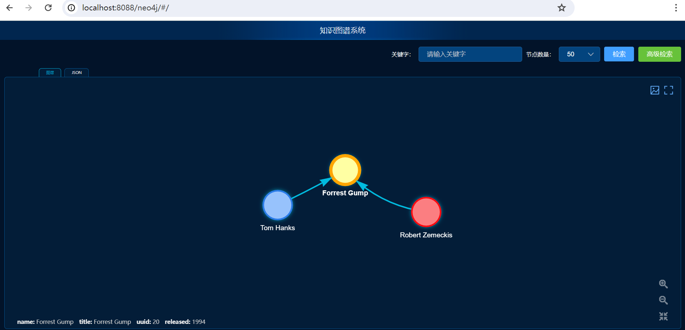

# springboot2-neo4j

#### 介绍
springboot2-neo4j是精简的java操作neo4j增删改查的知识图谱项目，基于Spring Boot2和Neo4j实现。

前端页面展示了图谱和简单查询功能

#### 技术方案

核心框架：Spring Boot2

知识图谱数据库：neo4j

API接口：Swagger2

前端框架：VUE、vis.js

#### 使用说明

1. 用IDEA导入本项目

2. 修改(resources/application.yml)配置文件，主要修改neo4j连接图库配置

3. 运行项目 
   3.1. 项目根目录下执行mvn springboot:run 
   3.2. 直接运行Application.java

4. 浏览器访问前端页面： http://localhost:8088/neo4j

5. 新建测试数据
  neo4j客户端brower命令窗口执行如下命令：
   CREATE (a:Person {name: 'Tom Hanks', born: 1956})-[r:ACTED_IN {roles: ['Forrest']}]->(m:Movie {name: 'Forrest Gump',title: 'Forrest Gump', released: 1994})
   CREATE (d:Person {name: 'Robert Zemeckis', born: 1951})-[:DIRECTED]->(m)
   RETURN a, d, r, m

6.前端页面刷新查看数据

#### 演示图
1.前端页面

 
